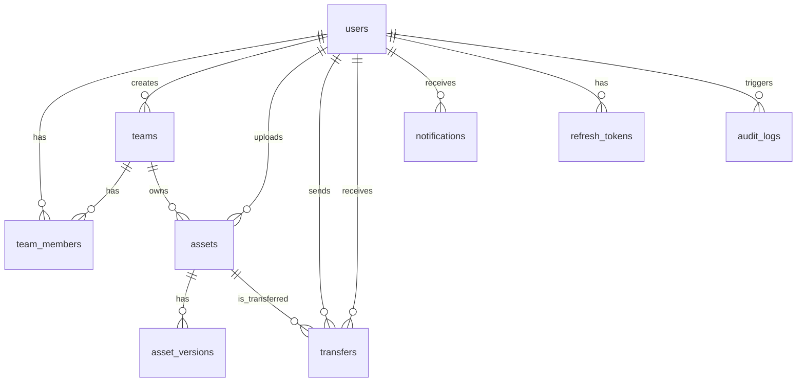

# M2-1 数据库模型与迁移草案

> 引擎：MySQL 8.0（RDS）  
> 数据库名：`xinghe_app`  
> 字符集：`utf8mb4`  
> 排序：`utf8mb4_unicode_ci`  
> 时间：全部使用 `DATETIME` + UTC 存储，客户端自行转本地时区

---

## 一、ER 关系图



---

## 二、表结构定义

### 2.1 `users` — 用户表

```sql
CREATE TABLE users (
  id            BIGINT UNSIGNED AUTO_INCREMENT PRIMARY KEY,
  phone         VARCHAR(20)     UNIQUE DEFAULT NULL  COMMENT '手机号（可空，邮箱登录时）',
  email         VARCHAR(255)    UNIQUE DEFAULT NULL  COMMENT '邮箱（可空，手机登录时）',
  nickname      VARCHAR(100)    NOT NULL DEFAULT ''   COMMENT '昵称',
  avatar_url    VARCHAR(500)    DEFAULT NULL          COMMENT '头像 OSS 路径',
  status        ENUM('active','disabled','deleted') NOT NULL DEFAULT 'active',
  last_login_at DATETIME        DEFAULT NULL,
  created_at    DATETIME        NOT NULL DEFAULT CURRENT_TIMESTAMP,
  updated_at    DATETIME        NOT NULL DEFAULT CURRENT_TIMESTAMP ON UPDATE CURRENT_TIMESTAMP,

  INDEX idx_phone (phone),
  INDEX idx_email (email),
  INDEX idx_status (status)
) ENGINE=InnoDB DEFAULT CHARSET=utf8mb4 COLLATE=utf8mb4_unicode_ci
  COMMENT='用户表';
```

**设计说明**：
- `phone` 和 `email` 都可为空但至少一个非空（应用层校验），支持手机号和邮箱两种登录方式
- 不存密码哈希——第一版用验证码登录（手机/邮箱），无密码

### 2.2 `teams` — 团队表

```sql
CREATE TABLE teams (
  id            BIGINT UNSIGNED AUTO_INCREMENT PRIMARY KEY,
  name          VARCHAR(200)    NOT NULL              COMMENT '团队名',
  owner_id      BIGINT UNSIGNED NOT NULL              COMMENT '创建者用户ID',
  invite_code   VARCHAR(32)     UNIQUE NOT NULL       COMMENT '邀请码（短码）',
  max_members   INT UNSIGNED    NOT NULL DEFAULT 50   COMMENT '成员上限',
  status        ENUM('active','archived','deleted') NOT NULL DEFAULT 'active',
  created_at    DATETIME        NOT NULL DEFAULT CURRENT_TIMESTAMP,
  updated_at    DATETIME        NOT NULL DEFAULT CURRENT_TIMESTAMP ON UPDATE CURRENT_TIMESTAMP,

  INDEX idx_owner (owner_id),
  INDEX idx_invite (invite_code),
  CONSTRAINT fk_teams_owner FOREIGN KEY (owner_id) REFERENCES users(id) ON DELETE RESTRICT
) ENGINE=InnoDB DEFAULT CHARSET=utf8mb4 COLLATE=utf8mb4_unicode_ci
  COMMENT='团队表';
```

### 2.3 `team_members` — 团队成员关系表

```sql
CREATE TABLE team_members (
  id        BIGINT UNSIGNED AUTO_INCREMENT PRIMARY KEY,
  team_id   BIGINT UNSIGNED NOT NULL,
  user_id   BIGINT UNSIGNED NOT NULL,
  role      ENUM('owner','admin','member','viewer') NOT NULL DEFAULT 'member',
  joined_at DATETIME        NOT NULL DEFAULT CURRENT_TIMESTAMP,

  UNIQUE KEY uk_team_user (team_id, user_id),
  INDEX idx_user (user_id),
  CONSTRAINT fk_tm_team FOREIGN KEY (team_id) REFERENCES teams(id) ON DELETE CASCADE,
  CONSTRAINT fk_tm_user FOREIGN KEY (user_id) REFERENCES users(id) ON DELETE CASCADE
) ENGINE=InnoDB DEFAULT CHARSET=utf8mb4 COLLATE=utf8mb4_unicode_ci
  COMMENT='团队成员关系';
```

### 2.4 `assets` — 素材元数据表

```sql
CREATE TABLE assets (
  id              BIGINT UNSIGNED AUTO_INCREMENT PRIMARY KEY,
  team_id         BIGINT UNSIGNED NOT NULL              COMMENT '所属团队',
  uploader_id     BIGINT UNSIGNED NOT NULL              COMMENT '上传者',
  name            VARCHAR(500)    NOT NULL              COMMENT '素材名称',
  asset_type      ENUM('image','video','audio','document','project','other') NOT NULL,
  mime_type       VARCHAR(100)    DEFAULT NULL,
  file_size       BIGINT UNSIGNED DEFAULT 0             COMMENT '字节数',
  oss_key         VARCHAR(1000)   NOT NULL              COMMENT 'OSS 对象完整路径',
  thumb_oss_key   VARCHAR(1000)   DEFAULT NULL          COMMENT '缩略图 OSS 路径',
  width           INT UNSIGNED    DEFAULT NULL          COMMENT '图片/视频宽',
  height          INT UNSIGNED    DEFAULT NULL          COMMENT '图片/视频高',
  duration_sec    DECIMAL(10,2)   DEFAULT NULL          COMMENT '视频/音频时长（秒）',
  tags            JSON            DEFAULT NULL          COMMENT '标签数组',
  description     TEXT            DEFAULT NULL,
  current_version INT UNSIGNED    NOT NULL DEFAULT 1,
  status          ENUM('active','archived','deleted') NOT NULL DEFAULT 'active',
  created_at      DATETIME        NOT NULL DEFAULT CURRENT_TIMESTAMP,
  updated_at      DATETIME        NOT NULL DEFAULT CURRENT_TIMESTAMP ON UPDATE CURRENT_TIMESTAMP,

  INDEX idx_team (team_id),
  INDEX idx_uploader (uploader_id),
  INDEX idx_type (asset_type),
  INDEX idx_status (status),
  INDEX idx_created (created_at),
  FULLTEXT INDEX ft_name (name),
  CONSTRAINT fk_assets_team FOREIGN KEY (team_id) REFERENCES teams(id) ON DELETE RESTRICT,
  CONSTRAINT fk_assets_user FOREIGN KEY (uploader_id) REFERENCES users(id) ON DELETE RESTRICT
) ENGINE=InnoDB DEFAULT CHARSET=utf8mb4 COLLATE=utf8mb4_unicode_ci
  COMMENT='素材元数据';
```

### 2.5 `asset_versions` — 素材版本表

```sql
CREATE TABLE asset_versions (
  id          BIGINT UNSIGNED AUTO_INCREMENT PRIMARY KEY,
  asset_id    BIGINT UNSIGNED NOT NULL,
  version     INT UNSIGNED    NOT NULL           COMMENT '版本号',
  oss_key     VARCHAR(1000)   NOT NULL           COMMENT '该版本 OSS 路径',
  file_size   BIGINT UNSIGNED DEFAULT 0,
  uploader_id BIGINT UNSIGNED NOT NULL,
  change_note VARCHAR(500)    DEFAULT NULL       COMMENT '版本说明',
  created_at  DATETIME        NOT NULL DEFAULT CURRENT_TIMESTAMP,

  UNIQUE KEY uk_asset_ver (asset_id, version),
  INDEX idx_asset (asset_id),
  CONSTRAINT fk_av_asset FOREIGN KEY (asset_id) REFERENCES assets(id) ON DELETE CASCADE,
  CONSTRAINT fk_av_user  FOREIGN KEY (uploader_id) REFERENCES users(id) ON DELETE RESTRICT
) ENGINE=InnoDB DEFAULT CHARSET=utf8mb4 COLLATE=utf8mb4_unicode_ci
  COMMENT='素材版本';
```

### 2.6 `transfers` — 素材发送/接收记录

```sql
CREATE TABLE transfers (
  id           BIGINT UNSIGNED AUTO_INCREMENT PRIMARY KEY,
  asset_id     BIGINT UNSIGNED NOT NULL,
  sender_id    BIGINT UNSIGNED NOT NULL,
  receiver_id  BIGINT UNSIGNED NOT NULL,
  team_id      BIGINT UNSIGNED NOT NULL           COMMENT '发生在哪个团队',
  message      VARCHAR(500)    DEFAULT NULL        COMMENT '附言',
  status       ENUM('pending','accepted','rejected','expired') NOT NULL DEFAULT 'pending',
  responded_at DATETIME        DEFAULT NULL        COMMENT '接收/拒绝时间',
  expires_at   DATETIME        DEFAULT NULL        COMMENT '过期时间',
  created_at   DATETIME        NOT NULL DEFAULT CURRENT_TIMESTAMP,

  INDEX idx_sender (sender_id),
  INDEX idx_receiver (receiver_id),
  INDEX idx_asset (asset_id),
  INDEX idx_status (status),
  INDEX idx_created (created_at),
  CONSTRAINT fk_tr_asset    FOREIGN KEY (asset_id) REFERENCES assets(id) ON DELETE RESTRICT,
  CONSTRAINT fk_tr_sender   FOREIGN KEY (sender_id) REFERENCES users(id) ON DELETE RESTRICT,
  CONSTRAINT fk_tr_receiver FOREIGN KEY (receiver_id) REFERENCES users(id) ON DELETE RESTRICT,
  CONSTRAINT fk_tr_team     FOREIGN KEY (team_id) REFERENCES teams(id) ON DELETE RESTRICT
) ENGINE=InnoDB DEFAULT CHARSET=utf8mb4 COLLATE=utf8mb4_unicode_ci
  COMMENT='素材发送接收';
```

### 2.7 `notifications` — 通知表

```sql
CREATE TABLE notifications (
  id           BIGINT UNSIGNED AUTO_INCREMENT PRIMARY KEY,
  user_id      BIGINT UNSIGNED NOT NULL             COMMENT '接收者',
  type         VARCHAR(50)     NOT NULL              COMMENT '通知类型: transfer_received, team_invite, system',
  title        VARCHAR(200)    NOT NULL DEFAULT '',
  body         TEXT            DEFAULT NULL,
  ref_type     VARCHAR(50)     DEFAULT NULL          COMMENT '关联类型: transfer, team, asset',
  ref_id       BIGINT UNSIGNED DEFAULT NULL          COMMENT '关联 ID',
  is_read      BOOLEAN         NOT NULL DEFAULT FALSE,
  created_at   DATETIME        NOT NULL DEFAULT CURRENT_TIMESTAMP,

  INDEX idx_user_read (user_id, is_read),
  INDEX idx_created (created_at),
  CONSTRAINT fk_notif_user FOREIGN KEY (user_id) REFERENCES users(id) ON DELETE CASCADE
) ENGINE=InnoDB DEFAULT CHARSET=utf8mb4 COLLATE=utf8mb4_unicode_ci
  COMMENT='通知';
```

### 2.8 `refresh_tokens` — 刷新令牌

```sql
CREATE TABLE refresh_tokens (
  id           BIGINT UNSIGNED AUTO_INCREMENT PRIMARY KEY,
  user_id      BIGINT UNSIGNED NOT NULL,
  token_hash   VARCHAR(128)    NOT NULL             COMMENT 'SHA-256 哈希，不存明文',
  device_info  VARCHAR(500)    DEFAULT NULL          COMMENT '设备标识',
  expires_at   DATETIME        NOT NULL,
  created_at   DATETIME        NOT NULL DEFAULT CURRENT_TIMESTAMP,

  INDEX idx_user (user_id),
  INDEX idx_hash (token_hash),
  INDEX idx_expires (expires_at),
  CONSTRAINT fk_rt_user FOREIGN KEY (user_id) REFERENCES users(id) ON DELETE CASCADE
) ENGINE=InnoDB DEFAULT CHARSET=utf8mb4 COLLATE=utf8mb4_unicode_ci
  COMMENT='刷新令牌';
```

### 2.9 `audit_logs` — 操作审计日志

```sql
CREATE TABLE audit_logs (
  id          BIGINT UNSIGNED AUTO_INCREMENT PRIMARY KEY,
  user_id     BIGINT UNSIGNED DEFAULT NULL        COMMENT '操作者（系统任务可空）',
  action      VARCHAR(100)    NOT NULL             COMMENT '操作类型',
  target_type VARCHAR(50)     DEFAULT NULL         COMMENT '操作对象类型',
  target_id   BIGINT UNSIGNED DEFAULT NULL,
  detail      JSON            DEFAULT NULL         COMMENT '操作详情',
  ip          VARCHAR(45)     DEFAULT NULL,
  created_at  DATETIME        NOT NULL DEFAULT CURRENT_TIMESTAMP,

  INDEX idx_user (user_id),
  INDEX idx_action (action),
  INDEX idx_target (target_type, target_id),
  INDEX idx_created (created_at)
) ENGINE=InnoDB DEFAULT CHARSET=utf8mb4 COLLATE=utf8mb4_unicode_ci
  COMMENT='操作审计';
```

---

## 三、迁移执行顺序

```
001_create_users.sql
002_create_teams.sql
003_create_team_members.sql
004_create_assets.sql
005_create_asset_versions.sql
006_create_transfers.sql
007_create_notifications.sql
008_create_refresh_tokens.sql
009_create_audit_logs.sql
```

> 严格按此顺序执行，因为外键依赖关系：users → teams → team_members → assets → …

---

## 四、与桌面端现有数据的衔接

| 桌面端现有数据 | 存储位置 | 上云后去向 |
|---------------|---------|-----------|
| 生成历史 `tapnow_history_v2_*` | 本地 SQLite | `assets` 表 + OSS |
| API 配置 `tapnow_api_configs` | 本地 SQLite / localStorage | 保留本地，云端不管私有密钥 |
| 角色库 `tapnow_characters` | 本地 SQLite | 如团队共享 → `assets`(type=project) |
| 项目文件 | 本地文件系统 | 如团队共享 → `assets`(type=project) + OSS |

> 核心原则：私有配置（API Key、本地路径）永远不上云；创作产物（图片、视频、项目文件）按需上传到团队素材库。
