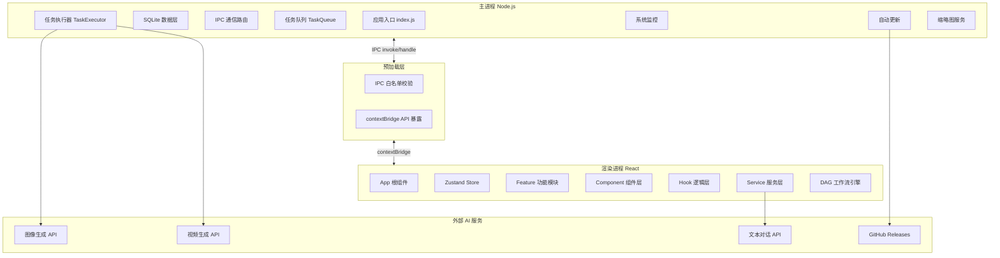
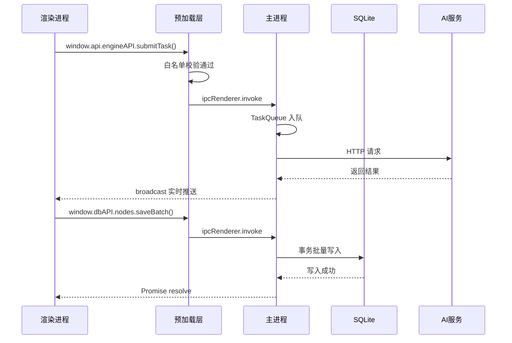
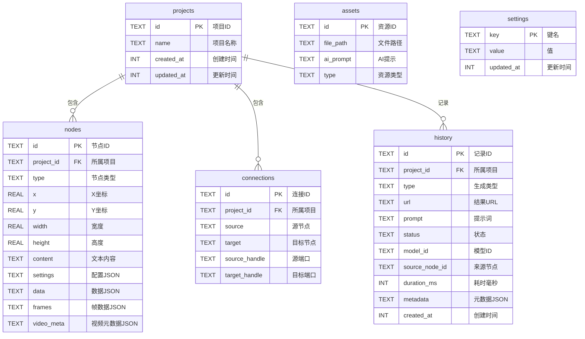
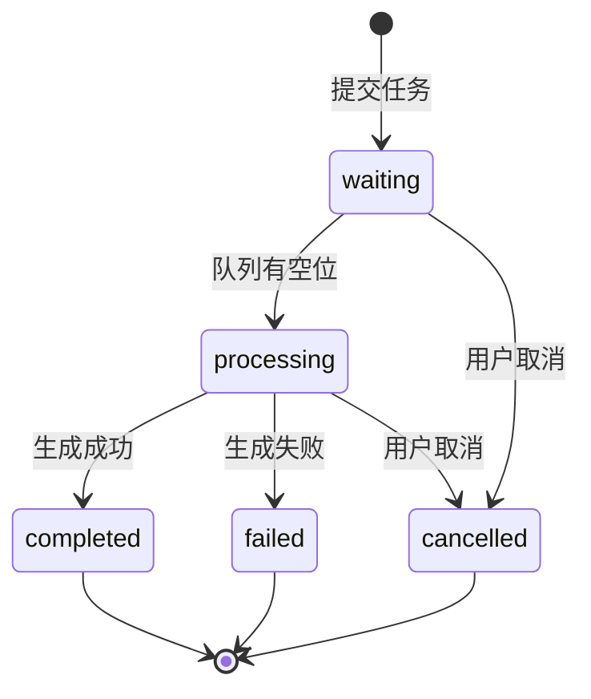
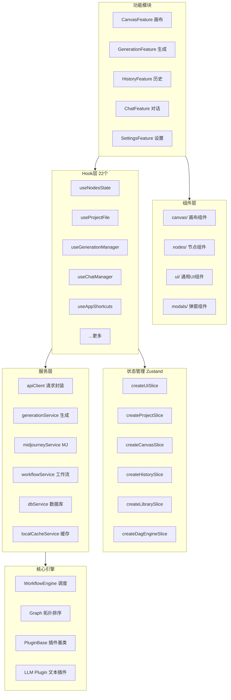
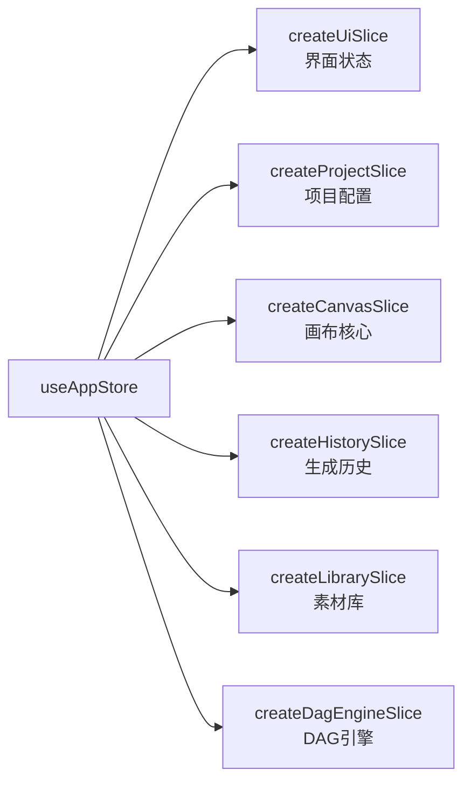
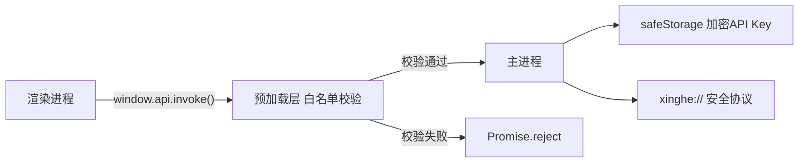
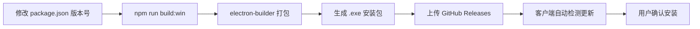

# 星河智绘 技术架构文档

> **版本** v1.0.4 ｜ **更新日期** 2026-03-24

---

## 一、项目简介

星河智绘是一款基于 Electron + React 的桌面端 AI 创作工具。通过可视化画布和节点编排，调用多种 AI 模型进行图像生成、视频生成和文本对话，为创意工作者提供一站式 AI 内容创作平台。

### 核心功能

| 功能 | 说明 |
|------|------|
| AI 图像生成 | 文生图、图生图、蒙版修复 (Inpainting) |
| AI 视频生成 | 图生视频、视频延伸，支持多参考源 |
| AI 对话 | 多轮对话侧边栏，支持文件上传 |
| DAG 工作流 | 节点连线自动按拓扑顺序执行 |
| 项目管理 | 多项目切换，SQLite 本地持久化 |
| 批量生成 | 选中多个历史记录批量重新生成 |
| 角色库 | 管理和复用 AI 角色参考 |
| 自动更新 | GitHub Releases OTA 推送 |

---

## 二、技术栈

| 分类 | 技术 | 版本 |
|------|------|------|
| 应用框架 | Electron | 40 |
| 构建工具 | electron-vite + Vite | 5 / 7 |
| 前端框架 | React | 19 |
| 状态管理 | Zustand (Slice 模式) | 5 |
| 画布引擎 | @xyflow/react (ReactFlow) | 12 |
| 本地数据库 | better-sqlite3 (SQLite WAL) | 12 |
| 样式方案 | TailwindCSS v4 + Vanilla CSS | 4 |
| 图标库 | Lucide React | — |
| Markdown 渲染 | marked | 17 |
| 打包发布 | electron-builder | 26 |
| 测试框架 | Vitest + Testing Library | 4 |
| 代码规范 | ESLint + Prettier | — |

---

## 三、系统架构



---

## 四、进程通信 (IPC)

渲染进程与主进程之间通过预加载脚本进行安全通信，所有通道均需白名单校验。



### IPC 通道分类 (共 41 个)

| 命名空间 | 数量 | 功能 |
|----------|:----:|------|
| `cache:*` | 11 | 本地缓存与文件管理 |
| `db:*` | 19 | 数据库 CRUD 操作 |
| `engine:*` | 3 | 任务引擎控制 |
| `safeStorage:*` | 3 | OS 级加密存储 |
| `updater-*` | 3 | 自动更新控制 |
| `monitor:*` | 1 | 系统监控 |
| `thumbnail:*` | 1 | 缩略图生成 |

---

## 五、数据库设计

使用 SQLite (WAL 模式) 本地存储，内置版本迁移机制 (`PRAGMA user_version`)。

### ER 关系图



### 数据库特性

| 特性 | 说明 |
|------|------|
| WAL 模式 | 支持读写并发，提升性能 |
| 外键级联删除 | 删除项目自动清理节点、连接、历史 |
| 版本迁移 | `PRAGMA user_version` 增量升级 Schema |
| 定时 Checkpoint | 每 5 分钟清理 WAL 日志 |
| 7 个索引 | 覆盖项目ID、连接源/目标、历史状态等 |

---

## 六、任务执行引擎

主进程中的 TaskQueue + TaskExecutor 构成 AI 任务调度核心。

### 任务生命周期



### 引擎参数

| 参数 | 值 | 说明 |
|------|:--:|------|
| 最大并发 | 3 | 同时运行的任务数上限 |
| 视频轮询间隔 | 30s | 查询视频生成状态 |
| 图像轮询间隔 | 10s | 查询图像生成状态 |
| 视频超时 | 25 分钟 | 300 轮后超时 |
| 图像超时 | 20 分钟 | 120 轮后超时 |

### 支持的 AI 模型

| 类型 | 模型 |
|------|------|
| 图像 | DALL-E / GPT-Image / Nano-Banana / Gemini / 即梦 |
| 视频 | Seedance / Doubao / Sora / Grok / Veo |
| 对话 | OpenAI API 兼容的所有模型 |

---

## 七、渲染层模块架构



---

## 八、状态管理

### Zustand Slice 切片架构



### 持久化策略

| 策略 | 实现 |
|------|------|
| 节流写入 | 自定义 2s 节流 Storage，拖动期间零 I/O |
| 选择性持久化 | memoized partialize，仅持久化必要字段 |
| 数据迁移 | 内置 migrate 函数，旧版数据自动升级 |
| 崩溃恢复 | onRehydrateStorage 错误时清除损坏数据 |

---

## 九、安全架构



| 安全层 | 说明 |
|--------|------|
| IPC 白名单 | 48 个允许通道，非白名单直接拒绝 |
| Context Isolation | 渲染进程无法访问 Node.js API |
| safeStorage | 操作系统级加密存储 API Key |
| xinghe:// 协议 | 自定义协议代理文件访问，替代 file:// |
| 崩溃保护 | 渲染进程崩溃自动重载，最多 3 次 |

---

## 十、性能优化

| 优化项 | 技术实现 | 效果 |
|--------|----------|------|
| RAF 批处理 | 合并同帧多次 onNodesChange | 减少 Store 更新 |
| 节流持久化 | 2s 节流 localStorage | 拖动零 I/O |
| 增量 Map | 仅位置变化时补丁更新 nodesMap | 避免全量重建 |
| 自定义相等性 | useAppStore 位置变化跳过重渲染 | 减少 React 渲染 |
| 视频流传输 | xinghe:// 支持 HTTP Range | 大文件分片加载 |
| GPU 加速 | enable-gpu-rasterization | 画布硬件加速 |
| CSS 隔离 | contain + content-visibility | 节点渲染隔离 |
| WAL + Checkpoint | SQLite WAL + 定时清理 | 高并发读写 |

---

## 十一、目录结构

```
src/
├── main/                          # 主进程
│   ├── index.js                   # 应用入口, 窗口管理, 自定义协议
│   ├── database.js                # SQLite 数据层 (6表, 7索引, 迁移)
│   ├── ipcHandlers.js             # IPC 路由 (41个端点)
│   ├── engine/
│   │   ├── TaskQueue.js           # 任务队列 (并发3)
│   │   └── TaskExecutor.js        # 执行器 (API调用, 轮询)
│   ├── systemMonitor.js           # CPU/内存/IPC 监控
│   ├── thumbnailService.js        # 缩略图生成
│   └── updater.js                 # 自动更新
│
├── preload/
│   └── index.js                   # 安全桥梁 (白名单 + contextBridge)
│
└── renderer/                      # 渲染进程
    ├── App.jsx                    # 根组件
    ├── main.jsx                   # React 入口
    ├── store/                     # 状态管理
    │   ├── useAppStore.js         # Zustand (节流持久化)
    │   └── slices/                # 6个状态切片
    ├── features/                  # 功能模块 (5个)
    ├── components/
    │   ├── canvas/                # 画布组件 (7个)
    │   ├── nodes/                 # 节点组件
    │   │   ├── gen/               # 生成节点子组件
    │   │   └── shared/            # 共享节点组件
    │   └── ui/                    # 通用UI (20个)
    │       └── modals/            # 弹窗 (4个)
    ├── hooks/                     # 自定义 Hook (22个)
    ├── services/                  # 业务服务 (9个)
    ├── core/dag_engine/           # DAG 工作流引擎 (插件架构)
    ├── utils/                     # 工具函数
    ├── contexts/                  # React Context
    └── styles/                    # 样式文件
```

---

## 十二、开发指南

### 环境准备

```bash
# 1. 克隆项目
git clone <repo-url>

# 2. 安装依赖 (自动编译 better-sqlite3 原生模块)
npm install

# 3. 启动开发模式 (支持热重载)
npm run dev
```

### 常用命令

| 命令 | 说明 |
|------|------|
| `npm run dev` | 启动开发模式 (HMR) |
| `npm run build` | 编译生产代码 |
| `npm run build:win` | 打包 Windows 安装包 |
| `npm run build:mac` | 打包 macOS 安装包 |
| `npm run test` | 运行单元测试 |
| `npm run lint` | ESLint 检查 |
| `npm run format` | Prettier 格式化 |

### 开发规范

#### 命名规范

| 类型 | 规则 | 示例 |
|------|------|------|
| React 组件 | PascalCase + .jsx | `GenToolbar.jsx` |
| 自定义 Hook | camelCase + use 前缀 | `useAppConfig.js` |
| 服务 | camelCase + Service 后缀 | `generationService.js` |
| Store Slice | create 前缀 + Slice 后缀 | `createCanvasSlice.js` |
| 工具函数 | camelCase + Helpers/Utils 后缀 | `dataHelpers.js` |
| CSS 类名 | kebab-case | `node-wrapper` |

#### 新增节点类型

1. 在 `components/nodes/` 下创建新节点组件
2. 在 `utils/nodeRegistry.js` 中注册节点配置
3. 在 `core/dag_engine/plugins/` 下添加对应插件
4. 在 `store/slices/createCanvasSlice.js` 中处理节点状态

#### 新增 AI 模型接入

1. 在 `main/engine/TaskExecutor.js` 中添加模型分支
2. 处理请求格式差异 (endpoint / body / headers)
3. 处理轮询响应格式差异 (状态字段 / URL 字段)
4. 在渲染进程 `utils/constants.js` 中添加模型常量

#### 新增 IPC 通道

1. 在 `main/ipcHandlers.js` 中注册 `ipcMain.handle`
2. 在 `preload/index.js` 的 `ALLOWED_CHANNELS` 白名单中添加通道名
3. 在 `preload/index.js` 的 API 对象中添加对应方法
4. 渲染进程通过 `window.api.invoke()` 调用

### Git 工作流

```mermaid
gitgraph
    commit id: "main"
    branch feature
    commit id: "开发新功能"
    commit id: "本地测试"
    checkout main
    merge feature id: "合并"
    commit id: "版本号+1"
    commit id: "打包发布" type: HIGHLIGHT
```

### 发布流程



---

## 十三、测试策略

| 测试类型 | 工具 | 覆盖范围 |
|----------|------|---------|
| 单元测试 | Vitest | 工具函数、服务层 |
| 组件测试 | Testing Library | React 组件交互 |
| 集成测试 | 手动 | IPC 通信、数据库操作 |
| E2E 测试 | 手动 | 完整用户流程 |

### 运行测试

```bash
# 运行全部测试
npm run test

# 监听模式
npm run test:watch

# 查看覆盖率
npm run test:coverage
```

---

## 十四、构建与发布

| 平台 | 输出格式 | 命令 |
|------|---------|------|
| Windows | NSIS 安装包 (.exe) | `npm run build:win` |
| macOS | DMG | `npm run build:mac` |
| Linux | AppImage / Snap / Deb | `npm run build:linux` |

### 自动更新

- 发布平台：GitHub Releases
- 更新检查：`electron-updater` 自动检测新版本
- 增量更新：通过 `.blockmap` 文件实现差量下载
- 安装方式：NSIS 安装包支持普通/管理员安装
