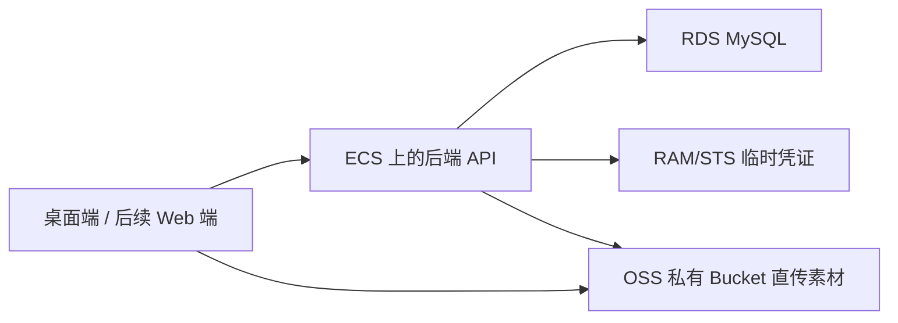

# 下一阶段未完成执行内容

更新时间：2026-05-02

> 这份文档只写我们还没做、但下一步可以排期推进的内容。重点解决两个问题：一是当前代码还缺什么，二是后面上云到底要在阿里云买什么。

---

## 一、当前还没做的执行内容总览

| 优先级 | 模块 | 状态 | 可以现在做吗 | 说明 |
| --- | --- | --- | --- | --- |
| P0 | 云端资源采购方案 | 未做 | 可以先做文档和架构 | 真购买前再按预算确认规格 |
| P0 | 后端 API 目录与数据模型 | 进行中 | 可以 | `server/` 本地后端骨架已创建，数据模型等 Claude 文档/迁移草案 |
| P0 | 登录/团队/素材库表结构 | 已完成初版 | 可以继续扩展 | RDS 已执行 `001_initial_schema.sql`，10 张表已创建 |
| P0 | OSS 直传与 STS 签发流程 | 已完成第一版 | 可继续联调前端 | 后端已用 RAM 用户生成 OSS signed URL，客户端不接触长期密钥 |
| P1 | 桌面端登录 UI | 未做 | 可以 | 后端登录/团队 API 已可用，桌面端可开始接真实 API |
| P1 | 团队素材库 UI | 未做 | 可以 | 先用 mock 数据展示上传、列表、筛选 |
| P1 | 素材发送/接收交互 | 未做 | 可以 | 先本地模拟通知和接收确认 |
| P1 | WebSocket/实时通知 | 未做 | 本地可以 | 上云后接真实网关 |
| P2 | Web 版适配层 | 未做 | 可以 | 先拆 Electron 专属能力，补平台 Adapter |
| P2 | 正式短信验证码 | 未做 | 等云账号和资质 | 开发期建议先用模拟验证码 |
| P2 | CDN/加速/日志告警 | 未做 | 后置 | 有真实用户后再开，避免一开始花冤枉钱 |

---

## 二、阿里云最小采购清单

### 方案 A：最稳妥的第一版，推荐

适合目标：先让 5-20 人团队能注册、登录、上传素材、团队库共享、发送/接收素材。

| 必买/开通 | 阿里云产品 | 用来做什么 | 首期建议 |
| --- | --- | --- | --- |
| 必买 | 云服务器 ECS | 跑 Node.js/Fastify 后端、WebSocket、定时任务 | 2 核 4G 起步，系统盘 40-80GB，先单台 |
| 必买 | 云数据库 RDS MySQL | 存用户、团队、素材记录、发送记录、通知记录 | MySQL 8.0，基础版/高可用版小规格起步 |
| 必买 | 对象存储 OSS | 存图片、视频、工程素材、用户上传文件 | 标准存储，单独 Bucket，先不开公共读 |
| 必开 | RAM + STS | 给客户端发临时上传凭证，避免把长期密钥放进软件 | 建 RAM 用户、RAM 角色、最小权限 Policy |
| 必买/准备 | 域名 | API 地址、Web 版地址、备案和 HTTPS 需要 | 建议一个主域名，预留 `api.`、`web.`、`cdn.` 子域名 |
| 必配 | SSL 证书 | HTTPS，登录和上传都必须走加密连接 | 可先用免费证书或云产品托管证书 |
| 大陆公网必做 | ICP 备案 | 如果域名解析到中国内地服务器，需要备案 | 备案周期不确定，尽早准备 |

首期建议架构：

为什么推荐 ECS 而不是一开始就上复杂架构：你现在还在产品验证期，ECS 最直观，Node 后端、WebSocket、队列小任务都能先塞在一台机器里，调试成本最低。等团队用起来后，再拆成函数计算、容器、负载均衡。

### 方案 B：更省运维的 Serverless 版，后续可选

| 产品 | 用法 | 适合情况 |
| --- | --- | --- |
| 函数计算 FC | 跑 HTTP API、STS 签发、轻量后台任务 | 请求量不稳定，希望少管服务器 |
| RDS MySQL 或 PolarDB | 存结构化业务数据 | 数据仍然需要关系型数据库 |
| OSS | 存素材文件 | 不变 |
| API 网关/自定义域名 | 对外暴露 API | 需要统一鉴权、限流时使用 |

注意：函数计算适合无状态 API，但 WebSocket、长连接、复杂本地调试会比 ECS 麻烦。第一版如果你想少踩坑，先 ECS。

### 方案 C：暂时不买云也能做的本地版

| 替代项 | 本地做法 | 后面怎么换 |
| --- | --- | --- |
| RDS | 本地 SQLite/MySQL | 迁移脚本导入 RDS |
| OSS | 本地 `uploads/` 目录 | 替换为 OSS SDK |
| STS | mock 上传凭证 | 替换为真实 STS AssumeRole |
| 短信 | 固定测试验证码 `123456` | 替换阿里云短信服务 |
| WebSocket | 本地 ws 服务 | 部署到 ECS |

---

## 三、哪些先不要买

| 暂缓产品 | 暂缓原因 | 什么时候再买 |
| --- | --- | --- |
| CDN | 早期素材量和访问量不大，OSS 私有访问够用 | 团队素材下载慢、跨地区访问多时 |
| 负载均衡 ALB | 单台 ECS 能扛第一版，ALB 会增加配置和成本 | 至少 2 台后端或需要灰度发布时 |
| Redis/Tair | 第一版通知和会话可先用数据库 | WebSocket 在线状态、限流、任务队列变复杂时 |
| SLS 日志服务 | 早期可先写本地文件和简单错误表 | 有线上用户，需要检索日志和告警时 |
| WAF/高防 | 成本较高，早期非必须 | 公网攻击、恶意请求明显时 |
| PolarDB | 比 RDS 更偏中大型弹性数据库 | RDS 成为瓶颈或业务规模明显扩大时 |
| 短信服务正式包 | 签名/模板审核需要时间，开发期可以模拟 | 准备真实注册登录内测前 |

---

## 四、阿里云控制台实际配置清单

### 1. 地域选择

| 选项 | 建议 |
| --- | --- |
| 中国内地团队使用 | 选离团队近的内地区域，例如华东/华北/华南，并准备备案 |
| 不想先备案 | 可先用中国香港区域做开发测试，但大陆访问速度和合规路径要另看 |
| OSS/RDS/ECS | 尽量选同一地域，减少内网延迟和跨区费用 |

### 2. ECS

建议首期：

- 实例：2 核 4G。
- 系统：Ubuntu LTS。
- 磁盘：系统盘 40-80GB。
- 带宽：先按固定带宽 3-5Mbps 或按量付费，视上传下载测试调整。
- 安全组：只开放 `22`、`80`、`443`，数据库不要开放公网。
- 部署内容：Node.js 后端、WebSocket 服务、Nginx、PM2 或 systemd。

### 3. RDS MySQL

建议首期：

- 引擎：MySQL 8.0。
- 网络：和 ECS 在同一个 VPC。
- 访问：只允许 ECS 内网访问，不开公网。
- 备份：开启自动备份，保留 7 天起。
- 数据库：`xinghe_app`。
- 账号：创建应用专用账号，不用高权限 root 跑业务。

首期表：

- `users`：用户。
- `teams`：团队。
- `team_members`：成员关系。
- `assets`：素材元数据。
- `asset_versions`：素材版本。
- `transfers`：发送/接收记录。
- `notifications`：通知。
- `refresh_tokens`：登录刷新令牌。
- `audit_logs`：关键操作审计。

### 4. OSS

建议首期：

- Bucket：私有读写。
- 存储类型：标准存储。
- 目录规划：
  - `teams/{teamId}/assets/{assetId}/original/{filename}`
  - `teams/{teamId}/assets/{assetId}/thumb/{filename}`
  - `users/{userId}/avatar/{filename}`
  - `temp/{date}/{uuid}`
- 权限策略：客户端不拿长期 AccessKey，只拿后端签发的 STS 临时凭证或服务端签名上传地址。
- 生命周期：`temp/` 目录 7 天自动删除；长期素材后续再考虑低频/归档。
- 跨域 CORS：允许桌面端/Web 端上传所需方法，至少 `PUT/POST/GET/HEAD`，域名上线后收紧来源。

### 5. RAM / STS

必须做：

- 创建一个后端专用 RAM 用户，只允许调用 STS AssumeRole。
- 创建一个 OSS 上传角色，例如 `xinghe-oss-uploader-role`。
- 给角色绑定最小权限，只能访问指定 Bucket 的指定路径。
- 后端根据登录用户和团队权限，签发短时凭证或预签名 URL。
- 客户端永远不要保存阿里云长期 AccessKey。

### 6. 域名 / HTTPS / 备案

建议子域名：

- `api.yourdomain.com`：后端 API。
- `web.yourdomain.com`：后续 Web 版。
- `assets.yourdomain.com`：后续 CDN/素材访问域名，可晚点启用。

如果使用中国内地 ECS、OSS 绑定自定义域名、CDN 等公网服务，需要走 ICP 备案。备案前要准备企业主体资料、域名实名认证、服务器/备案服务号等材料。

### 7. 短信服务

短信服务用于手机号验证码登录。开发期不建议一开始就接正式短信，可以先做：

- 本地/测试环境固定验证码。
- 管理员白名单账号。
- API 结构先按真实短信设计。

准备内测前再做：

- 申请短信签名。
- 申请验证码模板。
- 后端加发送频率限制。
- 登录失败、验证码错误、同手机号频率都写审计。

---

## 五、M2 云后端详细排期

### M2-0：云采购与账号安全准备（1-2 天）

| 状态 | 任务 | 交付物 |
| --- | --- | --- |
| [ ] | 确认地域、域名、是否先备案 | 云资源决策记录 |
| [ ] | 购买/开通 ECS、RDS、OSS | 控制台资源列表截图或资源 ID |
| [ ] | 创建 VPC/安全组/RDS 白名单 | ECS 可内网连 RDS |
| [ ] | 创建 RAM 用户、RAM 角色、最小权限 Policy | 后端可签发 OSS 临时上传权限 |
| [ ] | 申请 HTTPS 证书 | `api.` 域名可走 HTTPS |

### M2-1：本地后端骨架（2-3 天，可现在做）

| 状态 | 任务 | 交付物 |
| --- | --- | --- |
| [x] | 新建 `server/` 后端目录 | Fastify/Node/TypeScript 项目可启动 |
| [x] | 增加 `/health` | 本地返回 200 |
| [x] | 增加配置系统 | `.env.example`，不提交真实密钥 |
| [x] | 增加数据库迁移工具 | 已根据 `docs/m2/01-database-schema.md` 生成 `server/migrations/001_initial_schema.sql`，并已在 RDS `xinghe_app` 执行成功 |
| [x] | 增加基础测试 | API 冒烟测试可跑 |

### M2-2：账号与团队（3-5 天）

| 状态 | 任务 | 交付物 |
| --- | --- | --- |
| [x] | 手机号/邮箱测试登录 | 开发期固定验证码 `123456`，已接 RDS 真表 |
| [x] | JWT + refresh token | 已支持 access token、refresh token、logout |
| [x] | 团队创建/邀请/成员列表 | 已支持创建团队、我的团队列表、邀请码加入、成员列表、角色修改、移除成员 |
| [~] | 权限中间件 | 已有登录鉴权、团队成员校验、基础 owner/admin/member/viewer 权限；更细审计日志待补 |

### M2-2 当前落地记录

- [x] `POST /api/v1/auth/send-code`：开发期返回模拟验证码。
- [x] `POST /api/v1/auth/login`：验证码登录，首次登录自动创建用户。
- [x] `POST /api/v1/auth/refresh`：刷新 access token，并轮换 refresh token。
- [x] `POST /api/v1/auth/logout`：删除 refresh token。
- [x] `GET /api/v1/users/me`：读取当前用户。
- [x] `POST /api/v1/teams`：创建团队，创建者自动成为 owner。
- [x] `GET /api/v1/teams`：读取我的团队列表。
- [x] `POST /api/v1/teams/join`：通过邀请码加入团队。
- [x] `GET /api/v1/teams/:teamId/members`：读取团队成员列表，非成员返回 403。
- [x] `PATCH /api/v1/teams/:teamId/members/:userId`：owner 修改成员角色。
- [x] `DELETE /api/v1/teams/:teamId/members/:userId`：owner/admin 移除成员，成员可主动退出，owner 暂不能退出。
- [x] ECS `/opt/xinghe-cloud-api` 已通过 `npm run smoke:m2-2`，真实 RDS 冒烟成功。

### M2-3：素材库与 OSS（4-6 天）

| 状态 | 任务 | 交付物 |
| --- | --- | --- |
| [x] | 创建上传授权接口 | 返回 OSS signed URL，ECS 冒烟结果为 `signed_url` |
| [ ] | 桌面端直传 OSS | 大文件不经过后端中转 |
| [x] | 创建 asset 记录 | 数据库保存素材元数据 |
| [~] | 素材列表/详情/删除 | 已支持列表、详情、软删除；下载 signed URL 已预留，前端未接 |
| [ ] | 缩略图字段预留 | 后续图片/视频缩略图生成 |

### M2-3 当前落地记录

- [x] `POST /api/v1/teams/:teamId/assets/upload-url`：成员、管理员、所有者可获取 OSS 上传 signed URL。
- [x] `POST /api/v1/teams/:teamId/assets`：上传完成后创建素材元数据。
- [x] `GET /api/v1/teams/:teamId/assets`：分页读取团队素材列表。
- [x] `GET /api/v1/teams/:teamId/assets/:assetId`：读取素材详情。
- [x] `GET /api/v1/teams/:teamId/assets/:assetId/download-url`：生成私有素材下载 signed URL。
- [x] `DELETE /api/v1/teams/:teamId/assets/:assetId`：软删除素材，member 只能删自己上传的素材。
- [x] ECS `/opt/xinghe-cloud-api` 已通过 `npm run smoke:m2-2` 扩展冒烟，真实 RDS + 真实 OSS signed URL 通过。

### M2-4：发送/接收与通知（4-6 天）

| 状态 | 任务 | 交付物 |
| --- | --- | --- |
| [ ] | `transfers` 表与接口 | A 可把素材发给 B |
| [ ] | 接收/拒绝接口 | B 可确认接收 |
| [ ] | 通知列表 | 离线可查未读通知 |
| [ ] | WebSocket 在线推送 | 在线时实时收到发送提醒 |
| [ ] | 桌面端小精灵提醒 | 收到素材时小精灵弹提示 |

---

## 六、给 Claude 的建议分工

> 你不是一个人在战斗。下面这些适合分给 Claude 并行做，避免和我们当前前端/文档/采购方案互相踩文件。

| 分给 Claude | 负责范围 | 不要改 |
| --- | --- | --- |
| 后端数据模型草案 | 设计 `users/teams/assets/transfers/notifications` 表字段和索引 | 不改小精灵 UI |
| API 契约文档 | 写 OpenAPI 风格接口：登录、团队、素材、发送接收 | 不接真实阿里云密钥 |
| OSS Key 命名规则 | 设计团队素材路径、临时文件路径、删除策略 | 不改现有本地画布逻辑 |
| 权限矩阵 | owner/admin/member/viewer 权限表 | 不改前端状态管理 |
| Web 版适配调研 | 找出 Electron-only API，列迁移清单 | 不重构当前 Electron 主流程 |

我们这边更适合继续做：

- 桌面端团队素材库 UI mock。
- 小精灵收到素材/发送素材交互。
- `server/` 骨架落地。
- 阿里云采购前检查表和环境变量模板。

---

## 七、采购前最后确认问题

真正付款前只需要确认这 5 件事：

1. 第一批内测人数大概多少：5 人、20 人、还是 50 人。
2. 素材主要是图片还是视频：视频会明显影响 OSS 存储和下行流量。
3. 是否必须中国内地访问速度：是的话尽早备案。
4. 登录方式先用手机号还是邮箱：手机号要短信签名和模板。
5. 是否需要公司统一管理成员：需要的话团队/角色权限优先级提高。

---

## 八、参考来源

- [阿里云 OSS 对象存储](https://help.aliyun.com/zh/oss/)：用于海量、安全、低成本、高可靠文件存储。
- [阿里云 RAM/STS](https://www.alibabacloud.com/help/zh/ram/user-guide/what-is-sts)：用于签发临时访问凭证，避免客户端暴露长期 AccessKey。
- [阿里云 ECS 云服务器](https://help.aliyun.com/zh/ecs/)：弹性云服务器，适合第一版部署 Node 后端、WebSocket 与 Nginx。
- [阿里云 RDS](https://help.aliyun.com/zh/rds/)：托管关系型数据库，支持 MySQL 等引擎，并提供备份、恢复、迁移等能力。
- [阿里云 CDN](https://help.aliyun.com/zh/cdn/)：用于内容分发与静态资源加速，早期可暂缓。
- [阿里云短信服务](https://help.aliyun.com/zh/sms/)：用于验证码、通知等短信发送能力。
- [阿里云 ICP 备案流程](https://help.aliyun.com/zh/icp-filing/user-guide/using-icp-registration-guide-ali-cloud-app)：使用阿里云中国内地服务器对外提供服务时，需要按流程完成备案。
