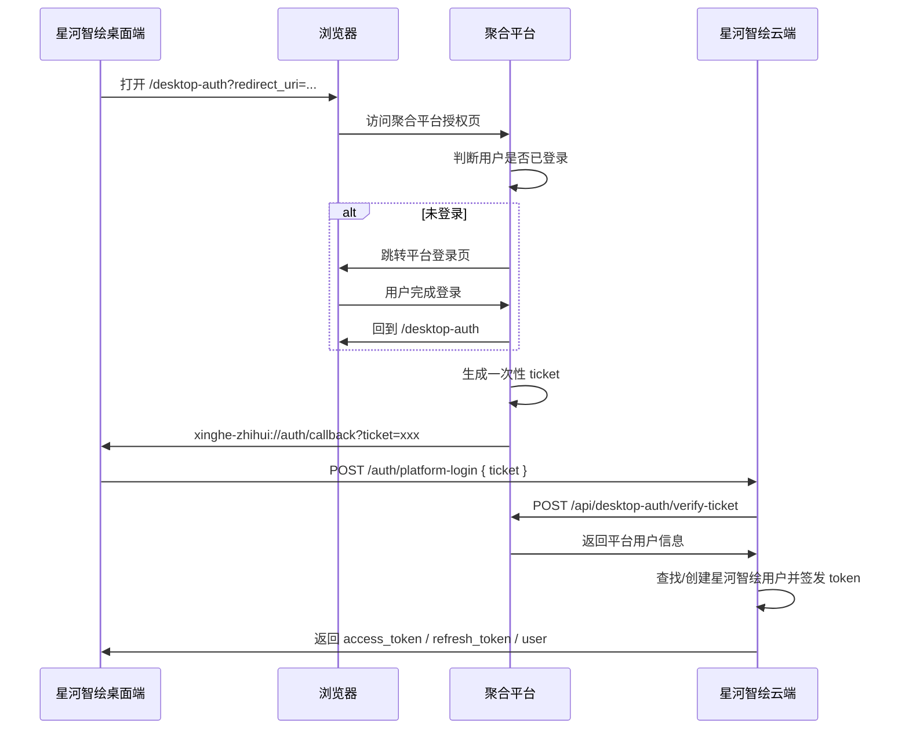

# 灵境星河聚合平台账号登录对接文档

## 1. 背景

星河智绘桌面端需要接入 `https://www.lingjingxinghe.cn/` 的聚合平台账号体系。

目标是：用户在桌面端个人中心点击“使用灵境星河账号登录”后，跳转到浏览器中的聚合平台完成登录，然后自动回到桌面端，并让桌面端获得本应用的登录态。

这条链路用于替代短信验证码登录。桌面端不再依赖接码或真实短信服务。

## 2. 当前问题

当前桌面端已经可以打开聚合平台登录页，并带上桌面端回调地址：

```text
redirect_uri=xinghe-zhihui://auth/callback
```

但现在如果浏览器里已经登录了聚合平台账号，平台会直接进入后台控制台，例如数据看板页面。

这说明平台登录页还没有处理 `redirect_uri`。它仍然按普通网页登录逻辑，把用户带到控制台，而不是带回桌面端。

正确行为应该是：

- 如果没有 `redirect_uri`：继续跳平台控制台。
- 如果存在合法 `redirect_uri`：生成一次性登录票据 `ticket`，并跳回桌面端。

## 3. 推荐方案

建议平台新增一个专门给桌面端使用的授权页：

```text
https://www.lingjingxinghe.cn/desktop-auth
```

桌面端打开：

```text
https://www.lingjingxinghe.cn/desktop-auth?client=xinghe-zhihui-desktop&redirect_uri=xinghe-zhihui://auth/callback&state=随机字符串
```

平台页面负责：

1. 判断用户是否已经登录聚合平台。
2. 未登录时，先进入平台登录流程。
3. 登录完成后回到 `/desktop-auth`。
4. 生成一个一次性 `ticket`。
5. 跳回桌面端：

```text
xinghe-zhihui://auth/callback?ticket=一次性ticket&state=原state
```

桌面端收到回调后，会拿 `ticket` 调用星河智绘云端接口 `/auth/platform-login`，最终换成本应用自己的 `access_token` / `refresh_token`。

## 4. 页面逻辑

伪代码如下：

```ts
// GET /desktop-auth?redirect_uri=xinghe-zhihui://auth/callback&state=xxx

const redirectUri = query.redirect_uri
const state = query.state

if (!isAllowedRedirectUri(redirectUri)) {
  throw new Error('非法 redirect_uri')
}

if (!currentUser) {
  redirectToLogin({
    returnUrl: currentFullUrl
  })
  return
}

const ticket = await createOneTimeDesktopTicket({
  userId: currentUser.id,
  client: 'xinghe-zhihui-desktop',
  expiresInSeconds: 300
})

const callbackUrl = new URL(redirectUri)
callbackUrl.searchParams.set('ticket', ticket)
if (state) callbackUrl.searchParams.set('state', state)

location.href = callbackUrl.toString()
```

## 5. Ticket 要求

`ticket` 是平台发给桌面端的一次性登录凭证，不是长期 token。

要求：

- 必须随机、不可预测。
- 只能使用一次。
- 建议 5 分钟过期。
- 校验成功后立即作废。
- 不能直接暴露平台长期 token。
- 不要把密码、AccessKey、平台敏感凭证放进回调 URL。

推荐 ticket 存储字段：

```text
ticket
user_id
client
expires_at
used_at
created_at
ip/user_agent 可选
```

## 6. 平台校验接口

平台需要提供一个后端接口，供星河智绘云端服务校验 ticket。

建议接口：

```http
POST /api/desktop-auth/verify-ticket
Content-Type: application/json
```

请求：

```json
{
  "ticket": "一次性ticket"
}
```

成功返回：

```json
{
  "code": 0,
  "data": {
    "platform_user_id": "平台用户ID",
    "phone": "手机号，可选",
    "email": "邮箱，可选",
    "nickname": "昵称",
    "avatar_url": "头像地址，可选"
  },
  "message": "ok"
}
```

失败返回示例：

```json
{
  "code": 40101,
  "data": null,
  "message": "ticket 已失效或不存在"
}
```

星河智绘云端收到平台用户信息后，会查找或创建本应用用户，并签发本应用自己的登录 token。

## 7. 安全要求

### 7.1 redirect_uri 白名单

平台必须校验 `redirect_uri`，只允许：

```text
xinghe-zhihui://auth/callback
```

不要允许任意 `http` / `https` / 自定义协议跳转，避免开放重定向风险。

### 7.2 state 原样回传

桌面端会传入 `state`。平台回跳时需要原样带回：

```text
xinghe-zhihui://auth/callback?ticket=xxx&state=xxx
```

后续桌面端可用它做请求状态校验。

### 7.3 ticket 一次性

`ticket` 被校验成功后必须立刻标记为已使用。

同一个 ticket 第二次校验必须失败。

### 7.4 ticket 短期有效

建议有效期 5 分钟。

过期 ticket 返回失败，不要自动续期。

## 8. 完整流程



## 9. 桌面端现状

桌面端已经准备好以下能力：

- 打开聚合平台登录/授权页。
- 注册桌面端回调协议：

```text
xinghe-zhihui://auth/callback
```

- 监听回调 URL。
- 从回调 URL 中读取 `ticket`。
- 调用云端接口：

```http
POST /auth/platform-login
```

桌面端需要平台最终回跳：

```text
xinghe-zhihui://auth/callback?ticket=一次性ticket&state=原state
```

## 10. 后端联调建议

联调时可以先用开发模式跑通链路：

1. 平台 `/desktop-auth` 生成固定或测试 ticket。
2. 星河智绘云端临时配置 `PLATFORM_SSO_DEV_TICKET`。
3. 桌面端收到该 ticket 后调用 `/auth/platform-login`。
4. 确认桌面端个人中心进入已登录状态。

正式上线前必须替换为真实 ticket 校验接口，不要使用固定 ticket。

## 11. 验收标准

开发完成后，按以下标准验收：

- 未登录聚合平台时，桌面端点击登录会打开浏览器登录页。
- 登录完成后，不进入控制台，而是自动回到桌面端。
- 已登录聚合平台时，桌面端点击登录后可直接授权并回到桌面端。
- 桌面端个人中心显示平台账号对应的用户信息。
- 重复使用同一个 ticket 会失败。
- 过期 ticket 会失败。
- 非白名单 `redirect_uri` 会被拒绝。
- 没有 `redirect_uri` 的普通网页登录仍然进入平台控制台。

